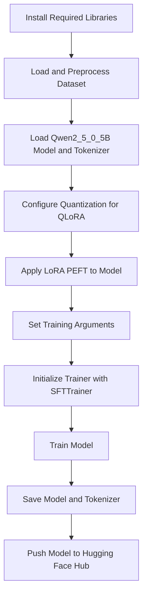

# Fine-Tuning Medical AI with LoRA and QLoRA

## Introduction
This project explores fine-tuning large language models (LLMs) for medical question answering using advanced parameter-efficient techniques. The focus is on LoRA (Low-Rank Adaptation) and QLoRA (Quantized LoRA), which enable efficient adaptation of powerful transformer models for specialized medical tasks, while minimizing computational and memory requirements.

## About Qwen2.5
Qwen2.5 is the latest series of Qwen large language models. For Qwen2.5, a number of base and instruction-tuned language models are released, ranging from 0.5 to 72 billion parameters. Qwen2.5 brings the following improvements upon Qwen2:

- Significantly more knowledge and greatly improved capabilities in coding and mathematics, thanks to specialized expert models in these domains.
- Significant improvements in instruction following, generating long texts (over 8K tokens), understanding structured data (e.g., tables), and generating structured outputs, especially JSON.
- More resilient to the diversity of system prompts, enhancing role-play implementation and condition-setting for chatbots.
- Long-context support up to 128K tokens and can generate up to 8K tokens.
- Multilingual support for over 29 languages, including Chinese, English, French, Spanish, Portuguese, German, Italian, Russian, Japanese, Korean, Vietnamese, Thai, Arabic, and more.

This repo contains the base 0.5B Qwen2.5 model, which has the following features:

- **Type:** Causal Language Models
- **Training Stage:** Pretraining
- **Architecture:** Transformers with RoPE, SwiGLU, RMSNorm, Attention QKV bias, and tied word embeddings
- **Number of Parameters:** 0.49B
- **Number of Parameters (Non-Embedding):** 0.36B
- **Number of Layers:** 24
- **Number of Attention Heads (GQA):** 14 for Q and 2 for KV
- **Context Length:** Full 32,768 tokens

> **Note:** It is not recommended to use base language models for conversations. Instead, you can apply post-training, such as SFT, RLHF, or continued pretraining, on this model for better conversational performance.

## Workflow Diagram

This diagram summarizes the main steps: library installation, dataset loading, model and tokenizer setup, quantization and LoRA configuration, training, saving, and uploading the fine-tuned model.

## Model Used
The main model is a fine-tuned version of the Qwen family, specifically `PavansaiGundaram/fine_tuned_qwen_medical_qa`. Qwen models are transformer-based LLMs designed for high performance on a variety of natural language processing tasks. The fine-tuned model is adapted for medical question answering using LoRA-based techniques, allowing for efficient and effective domain adaptation.

## What is Fine-Tuning?
Fine-tuning is a transfer learning technique where a pre-trained model is further trained on new data to adapt it to specific tasks. This process leverages the knowledge the model has already acquired during its initial training, making it more efficient than training a model from scratch. Fine-tuning is especially useful in NLP, where large models can be adapted to specialized tasks with relatively small datasets.

### Types of Fine-Tuning
- **Full Fine-Tuning:** All model parameters are updated. This approach requires significant compute and memory resources but allows the model to fully adapt to the new task.

- **Feature-Based Fine-Tuning:** Only the final layers or a subset of parameters are updated, reducing computational requirements and risk of overfitting.

- **Parameter-Efficient Fine-Tuning (PEFT):** Only a small number of additional parameters are trained, while the base model remains mostly frozen. LoRA and QLoRA are popular PEFT methods, enabling efficient adaptation with minimal resource usage.

## Different Methods for LLM Fine-Tuning
There are several fine-tuning methods and techniques used to adjust the model parameters to a given requirement. Broadly, these methods can be classified into two categories: supervised fine-tuning and reinforcement learning from human feedback (RLHF).

### a. Supervised Fine-Tuning
In this method, the model is trained on a task-specific labeled dataset, where each input data point is associated with a correct answer or label. The model learns to adjust its parameters to predict these labels as accurately as possible. This process guides the model to apply its pre-existing knowledge, gained from pre-training on a large dataset, to the specific task at hand. Supervised fine-tuning can significantly improve the model's performance on the task, making it an effective and efficient method for customizing LLMs.

**Common supervised fine-tuning techniques:**

1. **Basic hyperparameter tuning:** Manually adjusting hyperparameters (learning rate, batch size, epochs) to optimize performance.

2. **Transfer learning:** Using a pre-trained model as a starting point and fine-tuning it on task-specific data.

3. **Multi-task learning:** Fine-tuning on multiple related tasks simultaneously to improve generalization.

4. **Few-shot learning:** Adapting to a new task with very little task-specific data, often by providing examples in the prompt.

5. **Task-specific fine-tuning:** Adapting the model to the nuances and requirements of a targeted task for optimal performance.

### b. Reinforcement Learning from Human Feedback (RLHF)
RLHF is an innovative approach that involves training language models through interactions with human feedback. By incorporating human feedback into the learning process, RLHF facilitates the continuous enhancement of language models so they produce more accurate and contextually appropriate responses.

**Common RLHF techniques:**

1. **Reward modeling:** Human evaluators rank or rate model outputs, and the model learns to maximize predicted rewards.

2. **Proximal policy optimization (PPO):** An iterative algorithm that updates the model's policy to maximize expected reward while ensuring stable updates.

3. **Comparative ranking:** The model learns from relative rankings of multiple outputs provided by human evaluators.

4. **Preference learning:** The model learns from human preferences between pairs of outputs, useful for nuanced tasks.

5. **Parameter-efficient fine-tuning (PEFT):** Updates only a small subset of parameters, reducing compute and storage needs while maintaining performance.

## Step-by-Step Guide on How to Fine-Tune LLMs
Fine-tuning an LLM is not a one-size-fits-all process—it requires careful planning and optimization to achieve the best results. Several factors influence the efficiency, stability, and success of the fine-tuning process. Below are two key considerations that impact training time and performance:

- **Duration of fine-tuning:**

  The time required to fine-tune an LLM varies based on factors such as dataset size, model complexity, computational resources, and the chosen learning rate. For instance, using Low-Rank Adaptation (LoRA), a 13-billion-parameter model was fine-tuned in approximately 5 hours on a single A100 GPU. In contrast, fine-tuning larger models or using full fine-tuning methods without parameter-efficient techniques can extend the process to several days or even weeks, depending on the computational resources available.

- **Learning rate selection:**

  Choosing an appropriate learning rate is crucial. A high learning rate can lead to unstable training and convergence issues, whereas a low learning rate may slow down training and result in suboptimal performance. Experimenting with different learning rates or using techniques like learning rate scheduling can help find the optimal value.

By carefully considering these factors, organizations can optimize fine-tuning efficiency, reduce costs, and improve model accuracy.

### Steps to Fine-Tune an LLM

a. **Data preparation**

Curate and preprocess the dataset to ensure its relevance and quality for the specific task. This may include cleaning the data, handling missing values, and formatting the text to align with the model's input requirements. Data augmentation techniques can also be used to expand the training dataset and improve robustness.

b. **Choosing the right pre-trained model**

Select a pre-trained model that aligns with the specific requirements of the target task or domain. Consider the model architecture, input/output specifications, and performance on relevant tasks.

c. **Identifying the right parameters for fine-tuning**

Configure parameters such as learning rate, number of training epochs, and batch size. Selectively freeze certain layers (typically the earlier ones) while training the final layers to prevent overfitting and retain general knowledge.

d. **Validation**

Evaluate the fine-tuned model’s performance using a validation set. Monitor metrics such as accuracy, loss, precision, and recall to assess effectiveness and generalization.

e. **Model iteration**

Refine the model based on evaluation results. Adjust fine-tuning parameters, explore regularization techniques, or modify the model architecture to improve performance iteratively.

f. **Model deployment**

Integrate the fine-tuned model into the target environment, considering hardware/software requirements, scalability, and security. Ensure reliable deployment for real-world use.

## Best Practices for Fine-Tuning AI Models

- Start with a small learning rate to prevent the model from making drastic updates.

- Use early stopping to prevent overfitting by halting training when performance stops improving.

- Experiment with different optimizers, such as Adam, SGD, or RMSprop.

- Utilize automated tools: Platforms like AutoML can streamline hyperparameter optimization.

- Select a model that aligns closely with your task to minimize the extent of fine-tuning required.

- Ensure your fine-tuning dataset is representative of the target domain and free from biases or errors.

- Carefully tune hyperparameters, especially the learning rate, to balance training speed and model stability.

- Freezing the earlier layers of the model can preserve foundational knowledge and reduce training time, allowing the model to focus on learning task-specific features.

- Use methods such as dropout or weight decay to prevent overfitting and enhance generalization.

- Regularly evaluate the model's performance on validation data to detect and address issues like overfitting or underfitting promptly.

- Consider techniques like LoRA, which adds trainable low-rank matrices to the model, allowing efficient fine-tuning with fewer parameters.

## Understanding Hyperparameters in AI Models

Hyperparameters are adjustable settings that determine the structure and behaviour of a machine learning model. Unlike standard parameters, which are learned during training, hyperparameters are set before the training process begins. Common hyperparameters include:

- Learning Rate
- Batch Size
- Number of Epochs
- Model Architecture
- Dropout Rate

## About the Dataset

The dataset used for fine-tuning consists of medical question-answer pairs. Each entry includes a user query and a corresponding expert answer. The dataset is structured to help the model learn to generate accurate, context-aware medical responses. Datasets in medical NLP often require careful curation to ensure data quality, privacy, and domain relevance. (Add more details about your specific dataset, such as size, source, and preprocessing steps.)

## About LoRA

**LoRA (Low-Rank Adaptation)** is a parameter-efficient fine-tuning technique. Instead of updating all model weights, LoRA injects small trainable matrices (of low rank) into each layer. This drastically reduces the number of trainable parameters and memory usage, making it feasible to fine-tune large models on modest hardware.

- **Advantages:**
  - Reduces GPU memory requirements
  - Faster training and lower computational cost
  - Minimal impact on inference speed
- **How it works:**
  - Original weights are frozen
  - Low-rank matrices are trained and added to the model's output
  - Only a small number of parameters are updated, preserving the knowledge of the base model

## About QLoRA

**QLoRA (Quantized LoRA)** extends LoRA by applying quantization to the model weights, further reducing memory and compute requirements. QLoRA enables fine-tuning of very large models (even 65B+ parameters) on consumer GPUs by storing weights in 4-bit or 8-bit precision.

- **Advantages:**
  - Enables fine-tuning of extremely large models
  - Further reduces memory footprint and hardware requirements
  - Maintains high accuracy with quantization-aware training
  - Makes state-of-the-art LLMs accessible to a wider range of researchers and practitioners

## Evaluation Metrics

To assess the performance of the fine-tuned model, several evaluation metrics are commonly used in NLP and medical QA tasks:

- **Accuracy:** Measures the percentage of correct answers generated by the model.

- **F1 Score:** Harmonic mean of precision and recall, useful for imbalanced datasets.

- **BLEU (Bilingual Evaluation Understudy):** Evaluates the similarity between generated and reference answers based on n-gram overlap.

- **ROUGE (Recall-Oriented Understudy for Gisting Evaluation):** Measures overlap of n-grams, word sequences, and word pairs between the generated and reference answers.

- **Exact Match (EM):** Percentage of predictions that match any one of the ground truth answers exactly.

- **Domain-Specific Metrics:** In medical QA, additional metrics such as clinical accuracy, relevance, and expert review may be used to ensure the model's outputs are safe and reliable.

